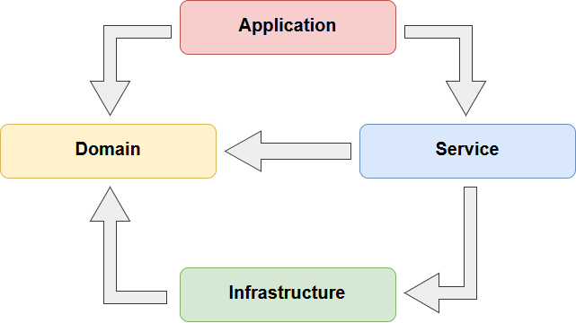

# ParseadorXMl
Parseador para xml versión 3.0, 3.2 y 3.3

### Pre-requisitos 📋

* Visual studio 2019 / Visual Studio Code
* Microsoft .NET Framework 4.5

## Comenzando 🚀
El proyecto utiliza la arquictectura DDD.

* Application
* Core
* Infrastructure
* Presentacion

## Autor ✒️

ISC.Magdiel Efrain Palacios Rivera.
